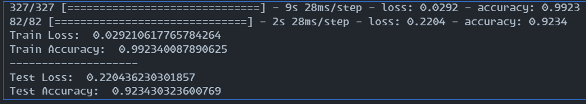
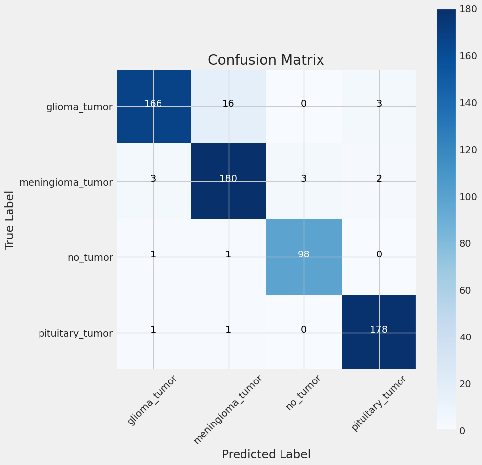
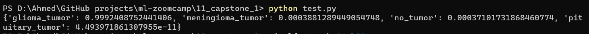

# Capstone 1: Brain Tumor Classification (MRI)

## Problem description

### Context

Brain tumors exhibit variations in sizes and locations, making it challenging to fully understand their nature. Professional neurosurgeons are typically required for MRI analysis, leading to difficulties in developing countries where a lack of skillful doctors and knowledge about tumors hinders the generation of timely and accurate reports from MRI scans. An automated system deployed on the cloud has the potential to address this challenge, providing a faster and more accessible solution for brain tumor classification.

### Conclusion

This capstone project addresses the critical need for accurate and efficient brain tumor classification using state-of-the-art Transfer Learning techniques. By leveraging the EfficientNetV2B3 network, the aim is to contribute to the development of an automated system that can significantly impact global healthcare, particularly in regions facing challenges related to expert availability and timely diagnosis.

For dataset access, please refer to [Dataset Link](https://www.kaggle.com/datasets/sartajbhuvaji/brain-tumor-classification-mri).

**All the dataset used in the project are provided and accessible within the repo.**

## Exploratory Data Analysis (EDA)

In this section, we present an exploratory data analysis (EDA) to gain insights into the dataset. The EDA focuses on visualizing a batch of images along with their corresponding labels using matplotlib.

```python
g_dict = train_gen.class_indices      # Defines a dictionary {'class': index}
classes = list(g_dict.keys())         # List of dictionary keys (classes)
images, labels = next(train_gen)      # Get a batch of samples from the generator

plt.figure(figsize=(20, 10))

# Display a subset of images with their labels
for i in range(8):
    plt.subplot(2, 4, i + 1)
    image = images[i] / 255            # Scale data to the range (0 - 255)
    plt.imshow(image)
    index = np.argmax(labels[i])       # Get the image index
    class_name = classes[index]        # Get the class of the image
    plt.title(class_name, color='blue', fontsize=12)
    plt.axis('off')

plt.show()
```

## Model Structure

To build the neural network for Brain Tumor Classification, an EfficientNetV2B3 architecture is employed. The model structure is defined with flexibility in mind, allowing for variations in learning rate, size of the inner dense layer, and dropout rate. The base EfficientNetV2B3 is used as a feature extractor, followed by additional layers for classification.

### Create Model Structure

```python
img_size = (224, 224)
channels = 3
img_shape = (img_size[0], img_size[1], channels)
class_count = len(list(train_gen.class_indices.keys())) # to define number of classes in dense layer

def make_model(learning_rate = 0.001 , size_inner=256, droprate=0.5):
    
    base_model = keras.applications.efficientnet_v2.EfficientNetV2B3(
        include_top= False,
        weights= "imagenet",
        input_shape= img_shape,
        pooling= 'max')
    
    base_model.trainable = False

    #########################################
    
    inputs = keras.Input(shape=img_shape)
    base = base_model(inputs, training=False)
    batch = keras.layers.BatchNormalization(axis= -1,
                                            momentum= 0.99,
                                            epsilon= 0.001)(base)
    inner = keras.layers.Dense(size_inner,
                               kernel_regularizer= regularizers.l2(l= 0.016),
                               activity_regularizer= regularizers.l1(0.006),
                               bias_regularizer= regularizers.l1(0.006),
                               activation='relu')(batch)
    drop = keras.layers.Dropout(droprate)(inner)
    outputs = keras.layers.Dense(class_count, activation= 'softmax')(drop)
    model = keras.Model(inputs, outputs)
    
     #########################################

    optimizer = keras.optimizers.Adam(learning_rate=learning_rate)
    loss = keras.losses.CategoricalCrossentropy()

    model.compile(
        optimizer=optimizer,
        loss=loss,
        metrics=['accuracy']
    )
    
    return model

model = make_model() # For testing the model function
model.summary()
```

## Model Training and Hyperparameter Tuning

### Learning Rate Tuning

The learning rate is a crucial hyperparameter affecting the convergence and performance of the model. A range of learning rates is tested to identify the optimal value.

```python
# Learning Rate Tuning
learning_rate_scores = {}

for lr in [0.0001, 0.001, 0.01, 0.1]:
    model = make_model(learning_rate=lr)
    history = model.fit(x=train_gen, epochs=20, validation_data=test_gen)
    learning_rate_scores[lr] = history.history
```

### Inner Dense Layer Size Tuning

The size of the inner dense layer is another key parameter influencing the model's capacity. Different sizes are explored to find the most suitable configuration.

```python
# Inner Dense Layer Size Tuning
size_scores = {}

for size in [32, 128, 256, 512, 1024]:
    model = make_model(learning_rate=learning_rate, size_inner=size)
    history = model.fit(x=train_gen, epochs=20, validation_data=test_gen)
    size_scores[size] = history.history
```

### Dropout Rate Tuning

Dropout is introduced to prevent overfitting by randomly dropping units during training. The dropout rate is adjusted to optimize model generalization.

```python
# Dropout Rate Tuning
droprate_scores = {}

for droprate in [0.0, 0.2, 0.5, 0.8]:
    model = make_model(
        learning_rate=learning_rate,
        size_inner=size,
        droprate=droprate
    )
    history = model.fit(x=train_gen, epochs=30, validation_data=test_gen)
    droprate_scores[droprate] = history.history
```

## Best Hyperparameter Values

After comprehensive tuning, the optimal hyperparameter values are determined:

- Learning Rate: 0.001
- Inner Dense Layer Size: 128
- Dropout Rate: 0.5

## Training and Evaluation

The final model is trained with callbacks for model checkpointing and early stopping to ensure the best-performing model is saved.

```python
# Training with Callbacks
checkpoint = ModelCheckpoint(
    'EfficientNetV2B3_best_model.h5',
    save_best_only=True,
    monitor='val_accuracy',
    mode='max'
)

early_stopping = EarlyStopping(patience=5, restore_best_weights=True)

# ... [Your training code with callbacks]
```
Subsequently, the model is evaluated on the test dataset, and the performance is analyzed using graphical representations such as accuracy graphs and confusion matrices.

## Testing and Evaluation

### Model Testing

After hyperparameter tuning, the final model is trained using callbacks to ensure the best version is saved. Let's proceed with testing the model on the test dataset:



## Performance Visualization

### Training and Validation Loss/Accuracy Graphs

Visualize the training and validation loss/accuracy over epochs to assess the model's learning progress.


#### Confusion Matrix

Evaluate the model's performance by plotting a confusion matrix using the test dataset.



#### Classification Report

Generate a classification report to provide additional metrics on model performance.


## Exporting notebook to script

The logic for training the best model is exported to a separate script named `train.py`.

## Dependencies and Virtual Environment

To set up your machine learning project, we've provided a Pipfile specifying the necessary dependencies and used Pipenv to create a virtual environment. Follow these steps to install the dependencies and activate the virtual environment:

### Step 1: Install Dependencies

1. Ensure you have Python 3.11 installed on your system.

2. Open a terminal and navigate to your project directory.

3. Create a virtual environment and install project dependencies using Pipenv:

   ```bash
   pipenv install
   ```

This command will create a virtual environment and install the required packages from the Pipfile.

### Step 2: Activate the Virtual Environment

1. Once the dependencies are installed, activate the virtual environment with this command:

   ```bash
   pipenv shell
   ```

    You will see the command prompt change to indicate that the environment is active.

    Now, your virtual environment is set up and activated. You can run your Flask application using Waitress with the following command:

    ```bash
    waitress-serve --listen=0.0.0.0:9696 gateway:app
    ```

Your Flask application will be accessible at `http://localhost:9696`.

Please ensure that you run this command within the activated virtual environment to use the correct dependencies. this is not working alone it's need tensorflow/serving image to work first before testing.

## Containerization

Our machine learning application has been containerized for easy deployment using Docker. To build and run the container, follow these steps:

### Step 1: Building the Model Container

1. Make sure you have Docker installed on your system.

2. Navigate to the directory containing your Dockerfile.

3. Use the following command to build the container. Replace `[containerName]` with your preferred container name (e.g., "ml-app"):

   ```bash
   docker build -t [containerName] -f image-model.dockerfile .
   ```

    This command instructs Docker to build an image using the `image-model.dockerfile` in the current directory.

### Step 2: Running the Container

1. Once the container is built, you can run it using the following command:

    ```bash
    docker run -it --rm -p 8500:8500 [containerName]
    ```

### Step 3: Building the Gateway Container

1. Make sure you have Docker installed on your system.

2. Navigate to the directory containing your Dockerfile.

3. Use the following command to build the container. Replace `[containerName]` with your preferred container name (e.g., "ml-app"):

   ```bash
   docker build -t [containerName]  -f image-gateway.dockerfile .
   ```

    This command instructs Docker to build an image using the `image-gateway.dockerfile` in the current directory.

### Step 4: Running the Container

1. Once the container is built, you can run it using the following command:

    ```bash
    docker run -it --rm -p 9696:9696 [containerName]
    ```

   - -it enables an interactive terminal.
   - --rm removes the container when it exits.
   - -p 9696:9696 maps port 9696 on your host to port 9696 within the container.
   - [containerName] is the name you provided when building the container.

2. Then, you can run the project with the following command:

    ```bash
    python test.py
    ```

Your machine learning application is now running within the Docker container, and you can access it at `http://localhost:9696`.

### Tensorflow/serving Dockerfile

Here is the content of the model Dockerfile used to create the container:

```docker
FROM tensorflow/serving:2.7.0

COPY brain-cancer-model /models/brain-cancer-model/1

ENV MODEL_NAME="brain-cancer-model"
```

### Gateway Dockerfile

Here is the content of the gateway Dockerfile used to create the container:

```docker
FROM python:3.11-slim

RUN pip install pipenv

WORKDIR /app

COPY ["Pipfile","Pipfile.lock","./"]

RUN pipenv install --system --deploy

COPY ["gateway.py" , "proto.py", "base.py" , "./"]

EXPOSE 9696

ENTRYPOINT [ "waitress-serve","--listen=0.0.0.0:9696","gateway:app" ]
```

This Dockerfile sets up a Python environment, installs dependencies, and exposes port 9696 to run your Flask application using Waitress. The `ENTRYPOINT` specifies how to start the application.

## Docker Compose

To simplify the deployment of both the model and gateway containers, we use Docker Compose. Follow these steps to set up and run your machine learning application using Docker Compose:

### Step 1: Docker Compose YAML

Create a file named `docker-compose.yml` in your project directory with the following content:

```yaml
version: "3.11"
services:
  brain-cancer-model:
    image: capstone-1-model:effv2b3-v1-001

  gateway:
    image: capstone-1-gateway:001
    environment:
      - TF_SERVING_HOST=brain-cancer-model:8500
    ports:
      - "9696:9696"
```

This Docker Compose file defines two services: brain-cancer-model and gateway. It specifies the images to use, environment variables, and port mappings.

### Step 2: Running Docker Compose

1- Open a terminal and navigate to your project directory.

2- Execute the following command to start the containers defined in the Docker Compose file:

```bash
docker-compose up
```
3- Docker Compose will download the necessary images and start the containers. You will see logs indicating the initialization process.

4- Access your machine learning application at `http://localhost:9696`.

### Step 3: Stopping Docker Compose

To stop the running containers, use the following command:

```bash
docker-compose down
```

This will stop and remove the containers defined in the Docker Compose file.

With Docker Compose, you can easily manage the deployment of your machine learning application, ensuring consistency and simplicity across different environments.

## Sample output

Locally, user shoud be able to get a similar output to the one shown below upon running all steps successfully.



Sample data used in predict-test.py

```python
data = {'url': 'https://raw.githubusercontent.com/ahmedokka29/ml-zoomcamp/main/11_capstone_1/data/Testing/glioma_tumor/image(1).jpg'}
```

## Results  
- Model: EfficientNetV2B3 (Transfer Learning)  
- Accuracy: 92% on test set  
- Dataset: 3,000 MRI scans (public Kaggle dataset)  
- Deployment: Dockerized Flask API (link to endpoint)  
